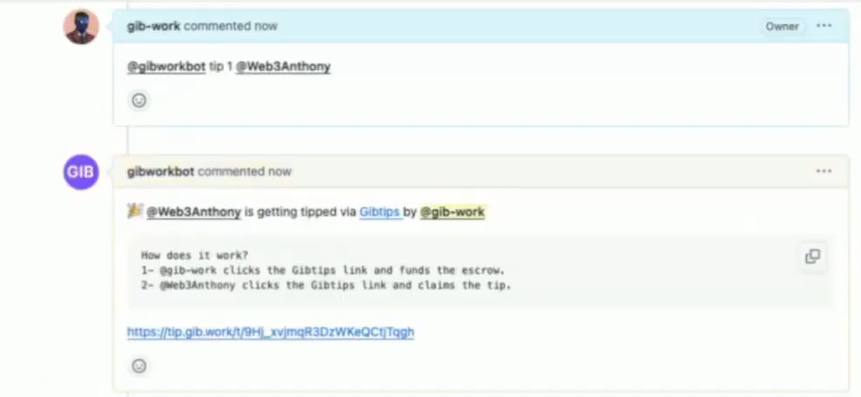
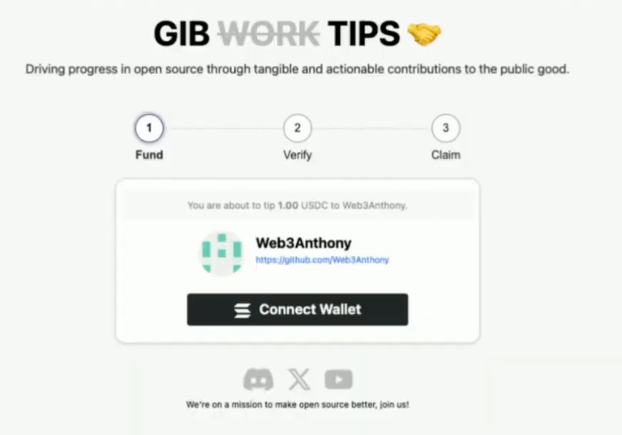
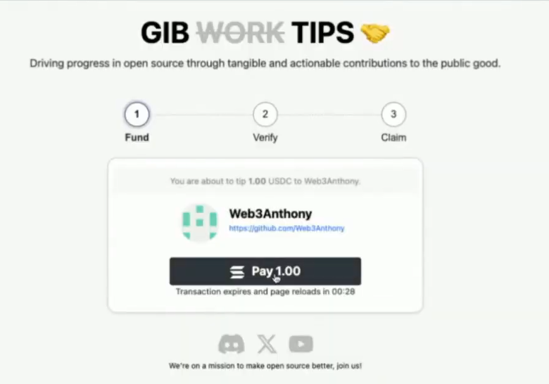
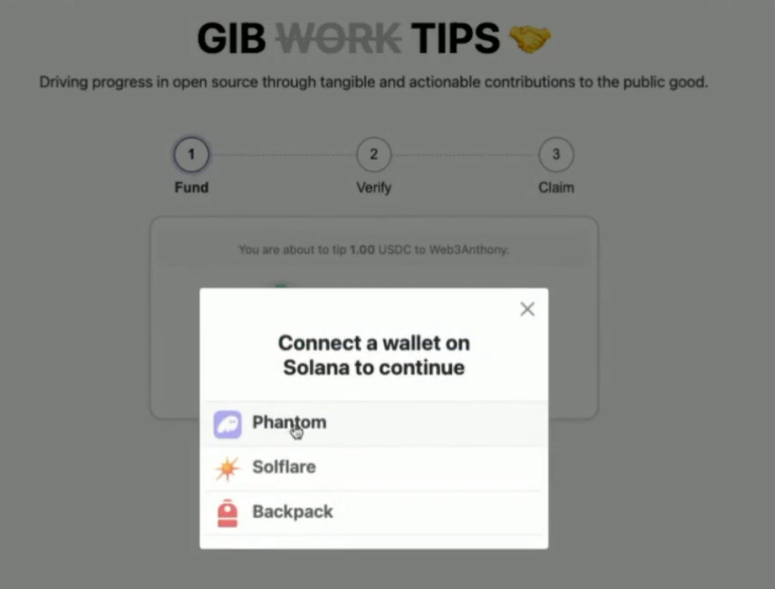
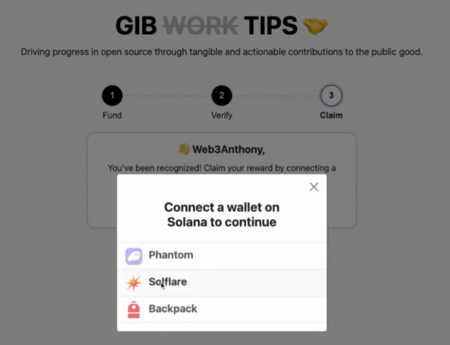
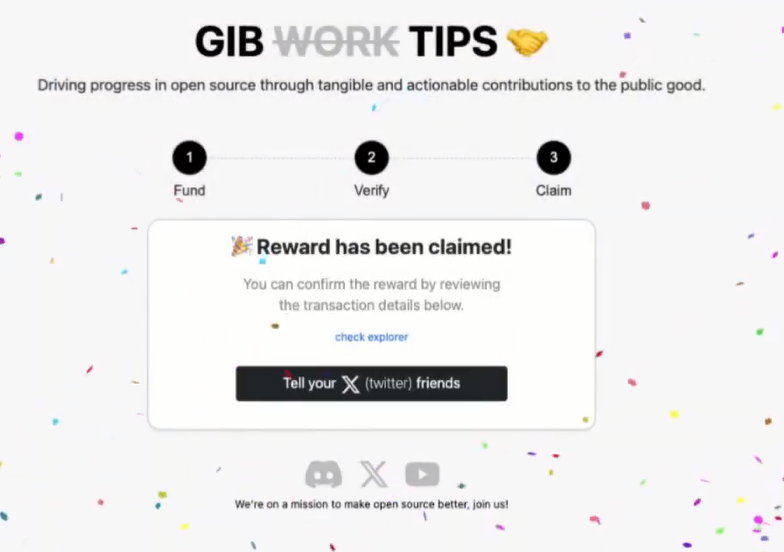

# GibWork Tipping System: Rewarding Open-Source Contributors Seamlessly

The world of open-source software has impacted countless lives, and we believe that the dedication and effort of contributors deserve recognition and reward. The GibWork Tipping system allows contributors to be easily rewarded for their contributions to any open source project.

## Getting Started with GibWork Tipping System
GibWork simplifies the process for contributors to be rewarded seamlessly. Here's how you can get started:

### GibWork Bot (Tipping via Github Issues)
Imagine you're browsing through a project you maintain, and you stumble upon a remarkable issue raised by a contributor. You're impressed and want to show appreciation by tipping them $1. Here's how easy it is with GibWork Tip Bot:

#### Tipping a Contributor
1. **Locate the Issue**: Identify the issue raised by the contributor.
2. **Tip the Contributor**: Utilize the GibWork bot with the command `@gibworkbot tip 1 @jhondoe`, where `1` signifies the tip amount and `@jhondoe` is the contributor's username. 
3. **Follow Bot's Instructions**: Within moments, the GibWork bot responds with clear instructions and a link to proceed. Click on the link, this link guides you to connect your wallet and complete the tipping transaction effortlessly. 

#### Claiming Your Tip as a Contributor
As a contributor, claiming your well-deserved tip is just as straightforward:

1. **Follow Bot's Instructions**: Click on the link provided by the GibWork bot in its reply.
2. **Verification Process**: Verify your GitHub account to authenticate your identity. 
3. **Connect Your Wallet**: Follow the prompts to connect your wallet securely. 
4. **Celebrate**: Voilà! Your tip is now safely deposited into your wallet. Celebrate your contribution and the recognition it deserves!. 
   

The Gibwork Tipping system offers a seamless way for open-source contributors to be rewarded for their valuable contributions to the community. Start tipping today! 😉
